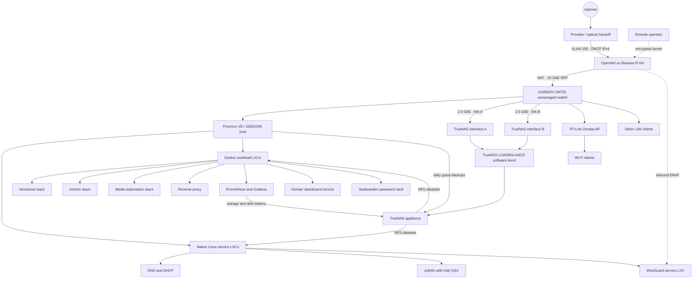
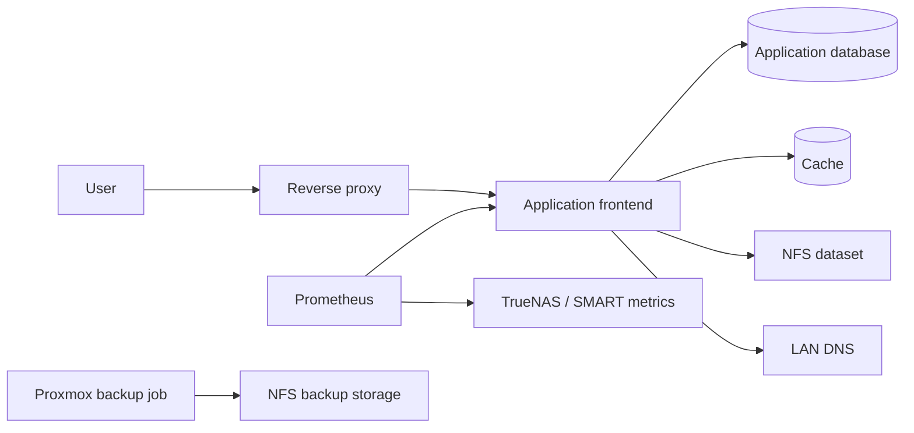

# Architecture

## Design goals

The lab is intentionally compact. It is large enough to exercise real infrastructure concerns, but small enough that every dependency can be understood and operated directly.

The core decisions are:

1. Use a dedicated hypervisor rather than installing applications on the host.
2. Give network, storage and application responsibilities separate service boundaries.
3. Keep latency-sensitive compute local while placing growing datasets on shared storage.
4. Prefer private access paths and centralized ingress over exposing every backend.
5. Treat monitoring and backup evidence as part of each service, not as later additions.

## Logical topology

Addresses, guest IDs, MAC addresses, internal names, routes and export paths are intentionally absent.

## Compute layer

A single Proxmox VE node runs Linux containers as the primary isolation mechanism. This keeps overhead low while preserving separate filesystems, resource assignments and service lifecycles.

Most guests are unprivileged. Workloads that need direct hardware or unusual kernel-facing behavior are treated as explicit exceptions. The media server receives only the required Intel render device, with a pre-start hook that restores device ownership after host reboot.

Vaultwarden runs in a dedicated unprivileged LXC with Docker Compose, local persistent data and an explicit AppArmor exception needed for nested Docker on this Proxmox version. LAN DNS resolves its service name to Nginx Proxy Manager, which terminates HTTPS and forwards to the guest. No public DNS record was observed for that name; remote access follows the private/VPN model.

An additional virtual machine exists for occasional lab use but was stopped during discovery and was not inspected from inside.

## Storage layer

The host NVMe provides Proxmox system storage and an LVM-thin pool for local guest roots. A separate TrueNAS appliance uses a healthy four-disk RAIDZ1 pool and exports NFS storage for:

- media data;
- private-cloud data;
- photo-library data;
- selected virtual disks;
- compressed Proxmox guest backups.

This split allows application runtimes and durable data to evolve at different rates. It also makes the NFS dependency explicit: a running container is not healthy if its required dataset is unavailable.

The storage layer uses LZ4 compression, daily recursive snapshots retained for four weeks, periodic scrubs, and scheduled short and long SMART tests. No replication or cloud-sync task was configured at review time, so the snapshots remain inside the primary storage failure domain.

## Network layer

The routed edge is a Banana Pi R4 running OpenWrt. Its active WAN path uses a 10 GbE SFP interface with subscriber VLAN 100, DHCP IPv4, a default route and NAT masquerading. DHCPv6 is configured on the same path but was down with no delegated prefix or IPv6 default route at review time.

The router reaches the downstream network through a separate, audit-verified 10 GbE SFP LAN link. The owner identifies the downstream device as a UGREEN CM753 unmanaged switch. Proxmox runs on the GEEKOM host, while TrueNAS uses two audit-verified 2.5 GbE interfaces in a TrueNAS `LOADBALANCE` software bond. The bond is configured on TrueNAS; no switch-side aggregation or failover capability is claimed, and the topology does not imply a 5 Gb/s single-client connection.

OpenWrt LAN DHCP is disabled. Pi-hole is the DHCP/DNS authority, and the router uses Pi-hole over both IPv4 and IPv6. OpenWrt's configured Wi-Fi radios are disabled; the owner identifies the external wireless layer as a TP-Link Omada access point.

WireGuard does not terminate on OpenWrt. The router DNATs one inbound UDP flow to the dedicated WireGuard LXC. Application download traffic uses a separate Gluetun VPN boundary, avoiding a shared trust path between administration and application egress. Nginx Proxy Manager remains the HTTP ingress tier for selected LAN services; no public reverse-proxy forwarding was observed on the router.

## Operational dependencies

The dependency chain is used during troubleshooting: entry point → process/container → application health → database/cache → mounted data → network/storage.

## Failure-domain notes

- The compute node is a single-node platform; there is no cluster failover.
- The router currently implements a flat LAN with no service or guest VLAN segmentation.
- WAN input is reject-by-default, but management listeners bind broadly and password-based root SSH remains enabled.
- TrueNAS is a shared dependency for several data-heavy applications.
- Some primary data and guest backups reside on the same storage appliance, so those copies are not fully failure-independent.
- The storage-network bond was observed from TrueNAS, but upstream switch behavior was not verified.
- No active UPS integration was observed for the storage appliance.
- A formal restore drill and an independent off-site copy remain on the recovery roadmap.
