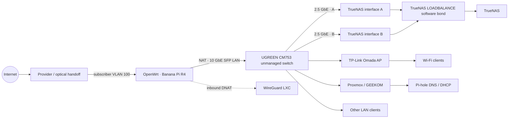

# Networking and security

## Verified topology

The routed edge is a Banana Pi R4 running OpenWrt on ARM64. The verified data path is:

Internal addresses, public addresses, MACs, names, forwarding ports and destination details are intentionally absent.

## Replacing the ISP router

**Owner-observed motivation (not independently audited):** the ISP-provided router limited control over the local network — in particular DNS behavior and advanced network configuration. The decision was to replace it with a fully controlled OpenWrt edge router placed behind the optical handoff, and to reproduce the ISP's WAN requirements on it: subscriber VLAN 100, DHCP IPv4, routing, NAT and firewalling.

**Result:** full control over WAN configuration, routing, NAT, firewall policy, DNS/DHCP integration (Pi-hole as LAN authority), port forwarding (the WireGuard DNAT), and a path toward future VLAN/network segmentation. The historical behavior of the ISP device is owner-observed context, not audit evidence; everything about the replacement edge is verified in the sections below.

## WAN architecture

**VERIFIED**

- The active WAN path uses the router's SFP WAN interface at 10 Gb/s, full duplex.
- An 802.1Q subinterface with VLAN ID 100 carries the WAN service.
- IPv4 is obtained by DHCP.
- A global IPv4 address and IPv4 default route were present at review time.
- The WAN firewall zone performs masquerading; active nftables NAT actions were observed.
- A DHCPv6 interface is configured on the same VLAN-tagged device.
- The DHCPv6 interface was down, with no delegated prefix and no IPv6 default route at review time.

**INFERRED**

- VLAN 100 is the subscriber handoff expected by the upstream provider. The router proves the VLAN and physical SFP path, but it does not identify or describe the provider-side optical equipment.

**NOT VERIFIED**

- Provider-side configuration, optical signal state and carrier policy beyond the negotiated Ethernet link.
- Internet-side reachability of any local listener; no external probe was performed.

## LAN architecture

**VERIFIED**

- A single LAN bridge contains three copper LAN ports and one SFP LAN port.
- The SFP LAN link was active at 10 Gb/s, full duplex.
- The three router copper LAN ports had no carrier at review time.
- No router-side bridge VLAN sections were configured.
- The firewall contained only LAN and WAN zones; no service, guest, storage or management zones were present.
- The only configured zone forwarding was LAN to WAN.
- A ULA IPv6 prefix was configured for the LAN.

The result is a flat LAN at the router. Application separation currently comes from Proxmox/LXC/Docker boundaries, not network segmentation.

## DNS and DHCP

**VERIFIED**

- OpenWrt's LAN DHCP scope is disabled.
- Pi-hole is configured as the router's LAN DNS resolver over both IPv4 and IPv6.
- The existing Pi-hole audit independently verified that Pi-hole FTL is actively serving DNS and DHCP.
- dnsmasq and odhcpd still run on OpenWrt for router-local DNS and IPv6 control-plane functions, but OpenWrt is not the LAN DHCP authority.

This division keeps routing and firewalling on OpenWrt while centralizing client naming, lease management and DNS filtering on Pi-hole.

## Firewall and NAT

**VERIFIED**

The global firewall defaults are input reject, forward reject and output accept, with SYN-flood protection enabled. Zone-level policy overrides matter:

- **LAN zone:** input, output and forwarding accept; no masquerading.
- **WAN zone:** input reject, output accept and forwarding drop; masquerading enabled.
- **Forwarding:** LAN to WAN only.
- **Port-forward architecture:** one inbound UDP DNAT rule forwards WireGuard traffic from WAN to a LAN service.
- Runtime nftables state contained active WAN masquerade and DNAT actions.
- No guest/service VLAN zones or east-west segmentation rules were observed.

The follow-up audit verified two hardening changes made through LuCI: WAN input changed from accept to reject, and unnecessary LAN-zone masquerading was removed. Runtime nftables state changed accordingly while the WireGuard DNAT remained present.

## VPN and remote access

WireGuard does not terminate on OpenWrt. No WireGuard interface or peer configuration was present on the router. Instead:

1. OpenWrt receives the inbound UDP flow.
2. A DNAT rule forwards it to the dedicated WireGuard LXC.
3. The LXC terminates the encrypted tunnel and routes the VPN network.

The existing LXC audit found one configured peer. No peer key, endpoint, private key, preshared key or allowed-address set was retrieved during the router audit.

Application download traffic remains separate: qBittorrent uses Gluetun as an outbound VPN boundary. Administrative remote access and application egress are therefore different paths.

## Wi-Fi responsibility

**VERIFIED**

- Three wireless radio profiles exist in OpenWrt configuration, including 5 GHz and 6 GHz profiles.
- Every configured radio and AP interface is disabled.
- No wireless PHY or runtime Wi-Fi interface was active.
- No SSID or Wi-Fi key was queried.

OpenWrt is not providing Wi-Fi. The owner identifies the external wireless device as a TP-Link Omada access point connected through the UGREEN switch.

**NOT VERIFIED**

- SSIDs, radio tuning, client isolation or VLAN assignment on the external AP/controller.
- Wireless roaming and policy behavior.

## Physical-network findings

The router verifies a 10 GbE SFP WAN path and a separate 10 GbE SFP LAN uplink. The owner identifies the downstream device as a UGREEN CM753 unmanaged switch and the wireless device as a TP-Link Omada access point.

The TrueNAS audit independently verified two 2.5 GbE interfaces configured as a `LOADBALANCE` software bond on TrueNAS. This does not establish a 5 Gb/s single-client path and does not prove switch-side aggregation or failover behavior. From the router side, those bond members are behind the unmanaged switch and are not individually observable. OpenWrt therefore cannot confirm:

- switch compatibility with the bond mode;
- traffic distribution across TrueNAS links;
- per-link failover behavior;
- port-isolation behavior inside the switch.

Those require switch telemetry or controlled failure testing.

## Router management security

**VERIFIED**

- Dropbear SSH is enabled and listening broadly rather than being bound to a named trusted interface.
- SSH password authentication and root password authentication are enabled.
- LuCI/uHTTPd serves both HTTP and HTTPS on broad listeners.
- HTTP-to-HTTPS redirection is disabled.
- A DNS listener was present on the WAN/global address.
- The WAN zone input policy is reject.
- UPnP was neither enabled nor running, and no UPnP package was observed.
- The router runs an OpenWrt snapshot build rather than a stable release channel.

Because no internet-side test was performed, public reachability is not asserted as an observed end-to-end fact. WAN input reject now provides the primary perimeter control, but broad listeners, root password authentication and plaintext HTTP remain defense-in-depth gaps on trusted or VPN-accessible networks.

### Remaining hardening backlog — not applied by this audit

- Restrict SSH and LuCI listeners to trusted LAN or VPN paths.
- Disable SSH password/root-password authentication after validating key-only recovery access.
- Disable plaintext LuCI HTTP or enforce HTTPS redirection.
- Verify externally that the router is not acting as an open DNS resolver.
- Keep WAN exceptions narrow and periodically verify the effective nftables ruleset.
- Introduce policy-enforced VLANs for management, services, storage, guests and wireless clients where the downstream hardware supports them.
- Replace or regularly refresh the snapshot firmware through a planned, recoverable upgrade process.

These are findings only. No setting was changed by the audit.

## Service naming and application ingress

The public domain **hcxhub.com** is managed through **Cloudflare** for DNS. Internally, services are reached by meaningful hostnames (for example `proxmox.hcxhub.com`, `grafana.hcxhub.com`, `immich.hcxhub.com`, `homarr.hcxhub.com`) instead of memorized IP:port combinations. **Nginx Proxy Manager** provides the centralized HTTP/HTTPS reverse-proxy tier that maps those service hostnames to internal backends, while **Pi-hole** remains the LAN DNS/DHCP authority.

The benefits are operational: consistent service naming, centralized application ingress, backend addressing separated from user-facing URLs, and simpler day-to-day access.

Vaultwarden follows that pattern: a Pi-hole LAN-only service name resolves to Nginx Proxy Manager, which uses the existing wildcard certificate for HTTPS before forwarding to its dedicated LXC. HTTPS and the application's unauthenticated health endpoint were verified; account creation and subsequent registration lock-down remain separate operational steps.

**A DNS hostname does not mean public exposure.** The documented access model keeps services on private/VPN-reachable paths; hostnames are an internal naming and ingress convenience, not a statement that a service is published to the internet. No public reverse-proxy forwarding was observed on the router.

## Evidence classification

### VERIFIED

- Banana Pi R4/OpenWrt platform
- SFP WAN and LAN link state and negotiated speed
- VLAN 100, DHCP IPv4, default route and NAT
- Inactive WAN IPv6 path at review time
- Flat LAN bridge and absence of router-side VLAN segmentation
- Pi-hole DNS integration and disabled OpenWrt LAN DHCP
- Firewall zones, forwarding and WireGuard DNAT architecture
- Disabled OpenWrt Wi-Fi radios
- Router management listeners and authentication settings
- Two TrueNAS 2.5 GbE interfaces and the TrueNAS `LOADBALANCE` software-bond configuration

### OWNER-SUPPLIED

- The downstream switch is a UGREEN CM753 unmanaged switch.
- The OpenWrt 10 GbE SFP LAN path connects to that switch.
- The TP-Link Omada access point connects downstream through that switch and serves Wi-Fi clients.
- Proxmox/GEEKOM, TrueNAS and other LAN clients attach to the same physical switching layer.

### INFERRED

- The upstream optical handoff/provider requires VLAN 100.

### NOT VERIFIED

- Provider-side optical configuration
- Actual public internet reachability of management or DNS listeners
- External AP/controller VLAN and security policy
- Downstream switch forwarding, isolation or link-aggregation behavior
- TrueNAS bond behavior from the router side
- End-to-end WireGuard connectivity during this router-only phase

## Public disclosure policy

The repository excludes:

- public and internal IP addresses;
- MAC addresses, internal hostnames and stable identifiers;
- Wi-Fi SSIDs and passwords;
- WireGuard private, preshared and peer keys;
- peer endpoints and allowed-address policy;
- forwarding port numbers and internal DNAT destinations;
- credentials, tokens, cookies and secret-bearing configuration;
- exact management URLs and firewall rule payloads.
